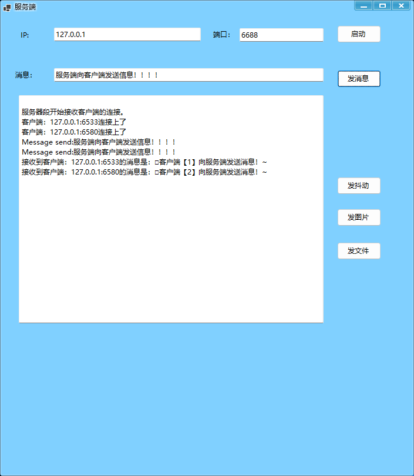
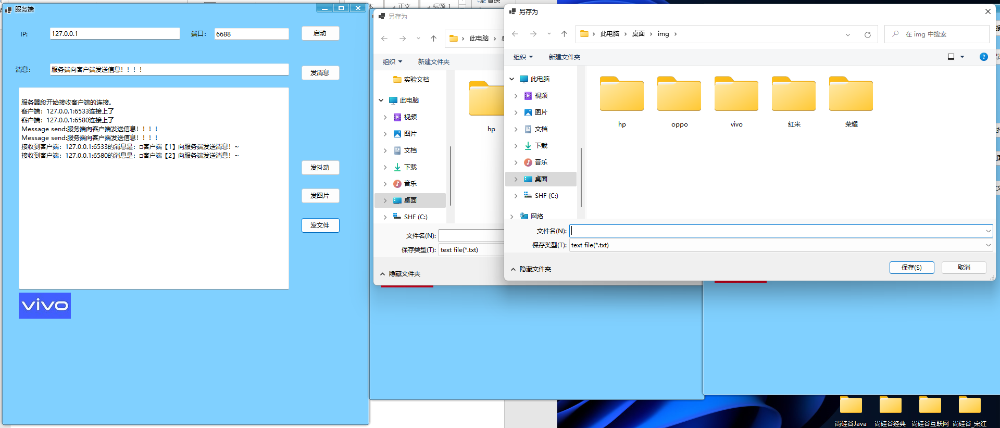

[1.初始界面（应用CSkin皮肤）... 1](#_Toc106282598)

[2.互发消息（新消息提示音、托盘图标闪烁）... 3](#_Toc106282599)

[3.托盘图标闪动... 5](#_Toc106282600)

[初始图标... 5](#_Toc106282601)

[4.互发图片... 5](#_Toc106282602)

[服务端给客户端发送图片所有客户端都能收到... 5](#_Toc106282603)

[5.互发小文件... 6](#_Toc106282604)

[5.窗体抖动（完成）... 7](#_Toc106282605)

[6.新消息提示音（完成）... 7](#_Toc106282606)

 

 

 

# 1.初始界面（应用CSkin皮肤）

# 2.互发消息（新消息提示音、托盘图标闪烁）

# 3.托盘图标闪动

**初始图标**

**收到消息**

 

# 4.互发图片

服务端给客户端发送图片所有客户端都能收到

# 5.互发小文件

# 5.窗体抖动（完成）

# 6.新消息提示音（完成）

新消息来到时调用 SystemSounds.Beep.Play();发出提示音